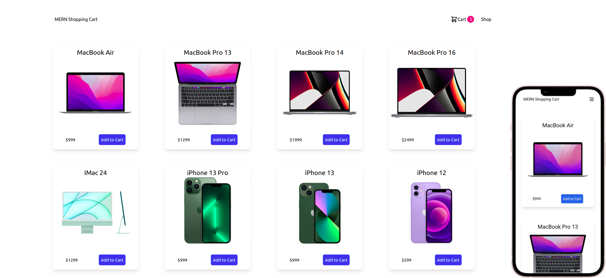

## `Table of Contents`

* [ About The App ](#about)
* [ Prerequisites ](#pre)
* [ Dependencies ](#dependencies)
* [ Install ](#insatll)
* [ Run the app ](#run)
* [ Import information into a database ](#db)

<a name="about"></a>

## `About the application`
MERN Shopping Cart -
Shopping Cart is an online store where you can find the product you want to add to the cart and buy it immediately or later.

## `App looks like`


<a name="pre"></a>

## `Prerequisites`

### <a href="https://nodejs.org/en/" target="_blank"> v16.13.0 and up
</a> 

### <a href="https://www.mongodb.com/" target="_blank"> db version v3.6.8 </a> 


<a name="dependencies"></a>

## `Dependencies`

| name  | version |
| ------------- | ------------- |
| cors  | ^2.8.5  |
| axios  | ^0.27.2  |
| redux  | ^4.2.0  |
| react-redux  | ^8.0.2  |
| redux-thunk  | ^8.0.2  |
| redux-devtools-extension  | ^2.4.1  |
| react-router-dom  | ^6.3.0  |
| dotenv  | ^16.0.1  |
| express | ^4.18.1 |
| mongoose | ^6.3.4 |
| concurrently | ^7.2.1 |
| nodemon | ^2.0.16 |
| @heroicons/react| ^1.0.6 |****
| tailwindcss| ^3.0.24 |


<a name="insatll"></a>

## `Install The App`

Download [ZIP](https://github.com/davitlabadze/mern-shopping-cart/archive/refs/heads/master.zip) or Clone repository

```bash
https://github.com/davitlabadze/mern-shopping-cart.git
```


## `Setup Frontend`
Go to the frontend directory Use this command `cd ../frontend`

#### `Install Node modules`

```bash
npm install
```

## `Setup Backend`

Return to the Main Directory Use this command `cd ../`

#### `Copy .env file`
```bash
cp .env.example .env
```

#### `Install Node modules`

```bash
npm install
```
<a name="db"></a>

## `Import information into a database`

```bash
npm run db:seed
```
# `Run The App`

### `Run full app`
```bash
npm run dev
```

### `Run node`
```bash
npm run start
```

### `Run server`
```bash
npm run server
```

### `Run react app`
```bash
npm run client
```


